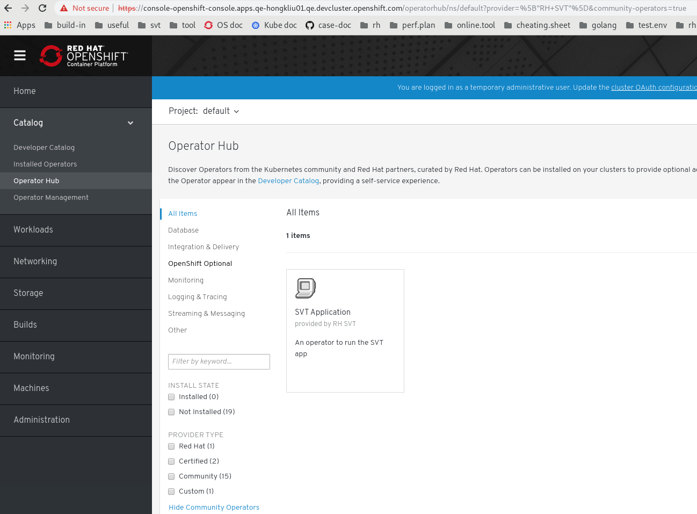

# OCP 4: operator framework

This page documents the revisit on OCP 4.0 of operator framework after [operator_framework.md](../learn/operator_framework.md).

## Make you own operator

svt-app-operator:

```
### https://github.com/operator-framework/operator-sdk
### https://github.com/operator-framework/operator-sdk/blob/master/doc/user-guide.md#2-run-locally-outside-the-cluster
### debugging operator locallay
# operator-sdk --version
operator-sdk version v0.5.0+git

# go get -d github.com/hongkailiu/operators/svt-app-operator
# cd ~/go/src/github.com/hongkailiu/operators/svt-app-operator
# oc new-project abc

$ kubectl create -f deploy/crds/app_v1alpha1_svt_crd.yaml 
$ kubectl create -f deploy/service_account.yaml
$ kubectl create -f deploy/role.yaml
$ kubectl create -f deploy/role_binding.yaml

# export OPERATOR_NAME=svt-app-operator
# operator-sdk up local --namespace=abc

### in another terminal
# oc create -f deploy/crds/app_v1alpha1_svt_cr.yaml 
# oc get deploy 
NAME   READY   UP-TO-DATE   AVAILABLE   AGE
svt    3/3     3            3           66s

# oc get svc
NAME   TYPE        CLUSTER-IP     EXTERNAL-IP   PORT(S)    AGE
svt    ClusterIP   172.30.230.3   <none>        8080/TCP   70s

# oc get svt
NAME   AGE
svt    2m1s
# oc get svt svt -o yaml
apiVersion: app.test.com/v1alpha1
kind: SVT
...
spec:
  size: 3
status:
  nodes:
  - svt-5ccf466b8c-f562w
  - svt-5ccf466b8c-khkjc
  - svt-5ccf466b8c-mrs4r

### access the svc out of the cluster network via route
# oc expose svc svt
+route.route.openshift.io/svt exposed
# oc get route
NAME   HOST/PORT                                            PATH   SERVICES   PORT   TERMINATION   WILDCARD
svt    svt-abc.apps.hongkliu1.qe.devcluster.openshift.com          svt        8080                 None
# curl svt-abc.apps.hongkliu1.qe.devcluster.openshift.com
{"version":"2.0.0","ips":["127.0.0.1","::1","10.128.2.51","fe80::60de:f7ff:fe55:35cd"],"now":"2019-02-26T18:01:28.955432726Z"}

# oc get svt svt -o yaml
apiVersion: app.test.com/v1alpha1
kind: SVT
...
spec:
  size: 2
status:
  nodes:
  - svt-5ccf466b8c-f562w
  - svt-5ccf466b8c-khkjc


```

Build image when all manual tests pass:

```
# operator-sdk build docker.io/hongkailiu/svt-app-operator:a012
# docker login docker.io
# docker push docker.io/hongkailiu/svt-app-operator:a012

```

Test with operator deployment:

```
# oc create -f ./deploy/operator.yaml
# oc get deploy
NAME               READY   UP-TO-DATE   AVAILABLE   AGE
svt-app-operator   1/1     1            1           32s
# oc get pod
NAME                                READY   STATUS    RESTARTS   AGE
svt-app-operator-59cf6f6f8d-q8gr6   1/1     Running   0          3m45s
# oc logs svt-app-operator-59cf6f6f8d-q8gr6 -f

### in another terminal ... start to test ...
# oc create -f ./deploy/crds/app_v1alpha1_svt_cr.yaml
...

```

## operator-hub

[community-operators](https://github.com/operator-framework/community-operators)

Add our operator `svt-app-operator` into the community:

Before commit to the repo, [test first](https://github.com/operator-framework/community-operators/blob/master/docs/testing-operators.md):

```
###https://github.com/operator-framework/operator-lifecycle-manager/blob/master/pkg/api/apis/operators/v1alpha1/clusterserviceversion_types.go
$ source p3env/bin/activate
$ pip3 install operator-courier
$ BUNDLE_DIR=${GOPATH}/src/github.com/hongkailiu/operators/svt-app-operator/deploy/BUNDLE_DIR
$ ll "$BUNDLE_DIR"
total 24
-rw-rw-r--. 1 hongkliu hongkliu   629 Feb 25 14:35 svt-app-operator.crd.yaml
-rw-rw-r--. 1 hongkliu hongkliu    95 Feb 26 01:17 svt-app-operator.package.yaml
-rw-rw-r--. 1 hongkliu hongkliu 15386 Feb 25 23:53 svt-app-operator.v0.0.2.clusterserviceversion.yaml

$ operator-courier verify $BUNDLE_DIR

$ AUTH_TOKEN=$(curl -sH "Content-Type: application/json" -XPOST https://quay.io/cnr/api/v1/users/login -d '
{
    "user": {
        "username": "'"${QUAY_USERNAME}"'",
        "password": "'"${QUAY_PASSWORD}"'"
    }
}' | jq -r '.token')


EXAMPLE_NAMESPACE=hongkailiu
EXAMPLE_REPOSITORY=svt-app-operator
EXAMPLE_RELEASE=0.0.2

$ operator-courier push "$BUNDLE_DIR" "$EXAMPLE_NAMESPACE" "$EXAMPLE_REPOSITORY" "$EXAMPLE_RELEASE" "$AUTH_TOKEN"
### then check https://quay.io/application/hongkailiu/svt-app-operator?tab=releases

```

Blocked by [operator-sdk-samples/issues/57](https://github.com/operator-framework/operator-sdk-samples/issues/57). 

20190227: Unblocked now.

```
$ cd ${GOPATH}/src/github.com/hongkailiu/operators/svt-app-operator
$ oc project openshift-marketplace
$ oc get OperatorSource
NAME                  TYPE          ENDPOINT              REGISTRY              DISPLAYNAME           PUBLISHER   STATUS      MESSAGE                                       AGE
certified-operators   appregistry   https://quay.io/cnr   certified-operators   Certified Operators   Red Hat     Succeeded   The object has been successfully reconciled   172m
community-operators   appregistry   https://quay.io/cnr   community-operators   Community Operators   Red Hat     Succeeded   The object has been successfully reconciled   172m
redhat-operators      appregistry   https://quay.io/cnr   redhat-operators      Red Hat Operators     Red Hat     Succeeded   The object has been successfully reconciled   172m

$ oc create -f deploy/test/community.operatorsource.cr.yaml 
operatorsource.marketplace.redhat.com/my-operators created

$ oc get OperatorSource my-operators
NAME           TYPE          ENDPOINT              REGISTRY     DISPLAYNAME           PUBLISHER   STATUS      MESSAGE                                       AGE
my-operators   appregistry   https://quay.io/cnr   hongkailiu   Community Operators   Red Hat     Succeeded   The object has been successfully reconciled   55s

```

After some minutes, refresh console UI. Operator `svt-app-operator` shows up:



We can also check by

```
$ kubectl get opsrc my-operators -o=custom-columns=NAME:.metadata.name,PACKAGES:.status.packages -n openshift-marketplace
NAME           PACKAGES
my-operators   svt-app-operator

###Note that CatalogSourceConfig is created already automatically
# oc get CatalogSourceConfig my-operators
NAME           TARGETNAMESPACE         PACKAGES           STATUS      DISPLAYNAME           PUBLISHER   MESSAGE                                       AGE
my-operators   openshift-marketplace   svt-app-operator   Succeeded   Community Operators   Red Hat     The object has been successfully reconciled   115m

### this pod will download the release info from app registry
# oc get pod my-operators-849b77b965-jxblq
NAME                            READY   STATUS    RESTARTS   AGE
my-operators-849b77b965-jxblq   1/1     Running   0          2m31s

# oc logs my-operators-849b77b965-jxblq | grep download
time="2019-02-27T17:33:45Z" level=info msg="downloading repository: hongkailiu/svt-app-operator:0.0.2 from https://quay.io/cnr" port=50051 type=appregistry
time="2019-02-27T17:33:47Z" level=info msg="download complete - 1 repositories have been downloaded" port=50051 type=appregistry

```

Release a new version:

```
EXAMPLE_RELEASE=0.0.3
$ operator-courier push "$BUNDLE_DIR" "$EXAMPLE_NAMESPACE" "$EXAMPLE_REPOSITORY" "$EXAMPLE_RELEASE" "$AUTH_TOKEN"

###if the new release is not picked up
$ oc delete pod my-operators-849b77b965-jxblq
###this will download the release again
```


We can install the operator on the UI. Or via oc cli:

UI method:

* Select `svt-app-operator` on `Operator Hub` then click `Install`.
* Choose a namespace eg, `bbb` that you created for testing.

```
### those resources are created automatically
# oc get subscription -n bbb
NAME               PACKAGE            SOURCE                 CHANNEL
svt-app-operator   svt-app-operator   installed-custom-bbb   alpha
# oc get installPlan
NAME            CSV                       SOURCE   APPROVAL    APPROVED
install-g4r7f   svt-app-operator.v0.0.8            Automatic   true
# oc get csv -n bbb
NAME                      DISPLAY           VERSION   REPLACES   PHASE
svt-app-operator.v0.0.8   SVT Application   0.0.8                Succeeded
# oc get operatorGroup -n bbb
NAME        AGE
bbb-qg468   14m
# oc get CatalogSource
NAME                   NAME               TYPE   PUBLISHER   AGE
installed-custom-bbb   Custom Operators   grpc   Custom      22m
# oc get deploy -n bbb
NAME               READY   UP-TO-DATE   AVAILABLE   AGE
svt-app-operator   1/1     1            1           13m
# oc get pod -n bbb
NAME                                READY   STATUS    RESTARTS   AGE
svt-app-operator-7bfb9c6997-cgrbm   1/1     Running   0          13m
# oc get pod -n bbb
NAME                                READY   STATUS    RESTARTS   AGE
svt-app-operator-7bfb9c6997-cgrbm   1/1     Running   0          13m

###Also notice an `CatalogSourceConfig` is created in `openshift-marketplace`
###https://github.com/operator-framework/operator-marketplace#using-the-marketplace-operator
# oc get CatalogSourceConfig installed-custom-bbb -n openshift-marketplace
NAME                   TARGETNAMESPACE   PACKAGES           STATUS      DISPLAYNAME        PUBLISHER   MESSAGE                                       AGE
installed-custom-bbb   bbb               svt-app-operator   Succeeded   Custom Operators   Custom      The object has been successfully reconciled   92m


### now we can deploy our cr and check if it works properly
# oc create -f deploy/crds/app_v1alpha1_svt_cr.yaml 
# oc get svt
NAME   AGE
svt    62s
# oc get svt svt -o yaml
apiVersion: app.test.com/v1alpha1
kind: SVT
metadata:
  creationTimestamp: 2019-02-28T15:02:45Z
  generation: 1
  name: svt
  namespace: bbb
  resourceVersion: "97289"
  selfLink: /apis/app.test.com/v1alpha1/namespaces/bbb/svts/svt
  uid: e791ce37-3b69-11e9-9057-0a7d73a12284
spec:
  size: 3
status:
  nodes:
  - svt-5ccf466b8c-q7sqm
  - svt-5ccf466b8c-rwws2
  - svt-5ccf466b8c-tvdfg

# oc get pod
NAME                                READY   STATUS    RESTARTS   AGE
svt-5ccf466b8c-q7sqm                1/1     Running   0          8m33s
svt-5ccf466b8c-rwws2                1/1     Running   0          8m33s
svt-5ccf466b8c-tvdfg                1/1     Running   0          8m33s
svt-app-operator-7bfb9c6997-cgrbm   1/1     Running   0          25m


```

oc cli method:

```
### https://github.com/operator-framework/operator-sdk-samples/issues/57#issuecomment-467562101
# oc get clusterversion
NAME      VERSION                             AVAILABLE   PROGRESSING   SINCE   STATUS
version   4.0.0-0.nightly-2019-02-27-213933   True        False         3h4m    Cluster version is 4.0.0-0.nightly-2019-02-27-213933

# oc new-project ccc
# cat ~/operatorGroup.yaml 
apiVersion: operators.coreos.com/v1alpha2
kind: OperatorGroup
metadata:
  annotations:
    olm.providedAPIs: SVT.v1alpha1.app.test.com
  generation: 2
  name: myog
spec:
  selector: {}
  targetNamespaces:
  - ccc

# oc create -f ~/operatorGroup.yaml

# cat ~/catalogSource.yaml
apiVersion: operators.coreos.com/v1alpha1
kind: CatalogSource
metadata:
  labels:
    csc-owner-name: installed-custom-ccc
    csc-owner-namespace: openshift-marketplace
  name: installed-custom-ccc
spec:
  address: 172.30.195.68:50051
  displayName: Custom Operators
  icon:
    base64data: ""
    mediatype: ""
  publisher: Custom
  sourceType: grpc

# oc create -f ~/catalogSource.yaml

# cat ~/subscription.yaml
apiVersion: operators.coreos.com/v1alpha1
kind: Subscription
metadata:
  name: svt-app-operator
spec:
  channel: alpha
  installPlanApproval: Automatic
  name: svt-app-operator
  source: installed-custom-ccc
  sourceNamespace: ccc
  startingCSV: svt-app-operator.v0.0.8

# oc create -f ~/subscription.yaml

### csv got created automatically
# oc get csv
NAME                      DISPLAY           VERSION   REPLACES   PHASE
svt-app-operator.v0.0.8   SVT Application   0.0.8                Succeeded
# oc get pod
NAME                                READY   STATUS    RESTARTS   AGE
svt-app-operator-56c5b995c8-fvcsh   1/1     Running   0          63s

###Not sure about `CatalogSourceConfig` in `openshift-marketplace` comparing to the UI method.

### We can start to delpy our crd and check as before
# oc create -f deploy/crds/app_v1alpha1_svt_cr.yaml 
...

```

When you are satisfied with the tests, join the compunity:

```
$ go get -d github.com/operator-framework/community-operators
$ cd ${GOPATH}/src/github.com/operator-framework/community-operators/community-operators/
$ mkdir -p svt-app-operator
$ cd svt-app-operator/
$ BUNDLE_DIR=${GOPATH}/src/github.com/hongkailiu/operators/svt-app-operator/deploy/BUNDLE_DIR
$ cp "$BUNDLE_DIR/*" .
### https://github.com/operator-framework/community-operators/pull/138

```

There are other concepts about `operatorGroup` and ``

Thanks for the operator team for those information:

```
Alexander Greene [19 minutes ago]
The `installModes` behave somewhat differently than you've described.  
When deploying your operator to a namespace OLM will look for an `OperatorGroup` in the namespace and see which `installMode` it matches. 
If the `installMode` is supported by your operator, OLM  will add an annotation to your csv with a string that lists which namespaces 
to watch seperated by commas. Your operator should look for this annotation and assign it to an environment variable. 
The operator then needs to be configured to watch those namespaces for CRs. (edited)


Alexander Greene [15 minutes ago]
OLM will deploy the operator if the `installMode` type of the `operatorGroup` in the `namespace`  is supported. 
The `installMode` type is identified by OLM based on the `targetNamespaces` field in the `operatorGroup` resource

https://docs.google.com/document/d/10SJ_k7efVMnNxv49AT-jTdvnKF_O0R1CFdT_-KOW1Qg/edit#heading=h.efjm54igbbni


Alec Merdler
https://github.com/operator-framework/operator-lifecycle-manager/pull/721


Kevin Rizza   [42 minutes ago]
@hongkliu the operator source creates a source from which data is obtained from quay. the subscription creation workflow is what adds the csv to the namespace
```

## [e2e test](https://github.com/operator-framework/operator-sdk/blob/master/doc/test-framework/writing-e2e-tests.md)

```
# kubectl create namespace operator-test
# cd ~/go/src/github.com/hongkailiu/operators/svt-app-operator
# operator-sdk test local ./test/e2e --namespace operator-test --go-test-flags "-v"

### with another terminal to watch changes during the e2e tests:
# oc get pod -n operator-test -w
# watch -n 10 "oc get svt -n operator-test example-svt -o yaml"

```

[e2e on travis-ci](https://blog.travis-ci.com/2017-10-26-running-kubernetes-on-travis-ci-with-minikube)

