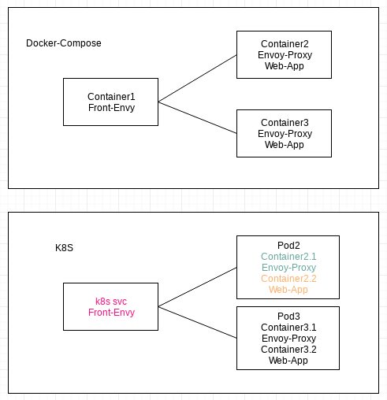

# [envoy](https://www.envoyproxy.io/)

* Matt_Klein_blog: [load-balancing-and-proxying](https://blog.envoyproxy.io/introduction-to-modern-network-load-balancing-and-proxying-a57f6ff80236),
    [data-plane-vs-control-plane](https://blog.envoyproxy.io/service-mesh-data-plane-vs-control-plane-2774e720f7fc)
* More: [announcing-envoy](https://eng.lyft.com/announcing-envoy-c-l7-proxy-and-communication-bus-92520b6c8191),
    [terminology](https://www.envoyproxy.io/docs/envoy/latest/intro/arch_overview/terminology)
    
Note that "the definitions of downstream and upstream is _slightly contentious_".

[Get started](https://www.envoyproxy.io/docs/envoy/latest/start/start):

```bash
$ docker pull envoyproxy/envoy:latest
$ docker run --rm -d -p 10000:10000 envoyproxy/envoy:latest
$ curl -v localhost:10000

###what is inside the container?
$ docker ps
CONTAINER ID        IMAGE                     COMMAND                  CREATED             STATUS              PORTS                      NAMES
f4ad12fabef7        envoyproxy/envoy:latest   "/usr/bin/dumb-ini..."   10 minutes ago      Up 10 minutes       0.0.0.0:10000->10000/tcp   condescending_banach

$ docker exec -it condescending_banach bash
root@f4ad12fabef7:/# ps -ef | grep envoy
root         1     0  0 17:41 ?        00:00:00 /usr/bin/dumb-init -- /bin/sh -c /usr/local/bin/envoy --v2-config-only -l $loglevel -c /etc/envoy/envoy.yaml
root         7     1  0 17:41 ?        00:00:00 /bin/sh -c /usr/local/bin/envoy --v2-config-only -l $loglevel -c /etc/envoy/envoy.yaml
root         8     7  0 17:41 ?        00:00:02 /usr/local/bin/envoy --v2-config-only -l info -c /etc/envoy/envoy.yaml
root        30    18  0 17:53 ?        00:00:00 grep --color=auto envoy

### the envoy config file: /etc/envoy/envoy.yaml

```

[sandboxes/front_proxy](https://www.envoyproxy.io/docs/envoy/latest/start/sandboxes/front_proxy):
front-envoy container (envoy) proxies 2 micro-service containers, each of those
has an envoy sidecar proxy running inside.



Let us simulate `container2` in this example in the context of k8s with the following modifications:
* Use 2 containers in the app pods, the additional one is for envoy sidecar.
* Use test-go-http as the web app
* `Container1` will become `k8s svc` to do the load-balancing and it will be integreated into `istio`.

Demo:

```bash
# oc new-project ttt
# oc process -f https://raw.githubusercontent.com/hongkailiu/svt-case-doc/master/files/envoy/hello/template_test_envoy.yaml | oc create -f -


# oc get pod -o wide
NAME          READY     STATUS    RESTARTS   AGE       IP           NODE                                          NOMINATED NODE
myapp-pod-1   2/2       Running   0          8s        172.23.0.4   ip-172-31-53-147.us-west-2.compute.internal   <none>

### curl the convoy container
# curl -v 172.23.0.4
...
< x-envoy-upstream-service-time: 0
< server: envoy
... 

###no such headers if curl directly the app container
# curl -v 172.23.0.4:8080

###https://www.envoyproxy.io/docs/envoy/latest/start/sandboxes/front_proxy
###admin port
# curl 172.23.0.4:8081/server_info
# curl 172.23.0.4:8081/stats

```

